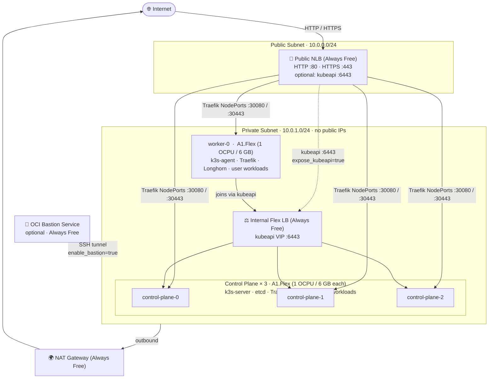

# k3s-oci

[](https://github.com/mbologna/k3s-oci/actions/workflows/terraform.yml)

A production-ready [k3s](https://k3s.io) Terraform module for the [OCI Always Free tier](https://docs.oracle.com/en-us/iaas/Content/FreeTier/freetier_topic-Always_Free_Resources.htm).

## Architecture



All four Always Free A1.Flex instances live in a **private subnet** with no public IPs, reducing the attack surface to near-zero. Internet traffic enters exclusively through two Always Free load balancers:

> **k3s naming note:** k3s calls control-plane nodes "servers" (`k3s server` command) and workers "agents" (`k3s agent`). Throughout this repo, Terraform resources and variable names use `server`/`worker` following k3s conventions. In standard Kubernetes terminology these map to control-plane and worker nodes respectively.

**Public Network Load Balancer (NLB)** handles HTTP/HTTPS from the internet and forwards it directly to Traefik NodePorts on all nodes (both control-plane and worker). Traefik runs as a **DaemonSet** (one pod per node) with `priorityClassName: system-cluster-critical` and `PodDisruptionBudget maxUnavailable: 1` so that at most one node is unavailable for ingress at any time — whether due to failure or rolling maintenance. `is_preserve_source = true` preserves real client IPs at the hypervisor level with no extra OS-level proxy. The NLB also optionally exposes the Kubernetes API on port 6443, restricted to your IP. It is the only Always Free-eligible TCP/UDP load balancer on OCI that provides health checks, source IP preservation, and a static public IP simultaneously.

**Internal Flexible Load Balancer** provides a stable private VIP for the k3s API across all three control-plane nodes. The worker and any future agents always join via this VIP, so the cluster survives the loss of any single control-plane. The Flexible LB (10 Mbps Always Free tier) is the right tool here: it handles HTTP-based health checks against the k3s API port, which the NLB cannot do internally on a private subnet without additional cost.

**Longhorn** runs on **all four nodes** with `defaultReplicaCount=3` — each PVC is replicated across three different nodes, so storage remains available after any single node failure. The control-plane `NoSchedule` taints (added automatically by k3s ≥ 1.24) are removed immediately after cluster init so that **user workloads schedule across all four nodes**. With only one worker, keeping those taints would make it a single point of failure for all workloads. All A1.Flex nodes are identically sized (1 OCPU / 6 GB), so co-locating etcd with user workloads is safe at this scale.

> **HA ceiling:** etcd runs on the 3 control-plane nodes (quorum = 2). The cluster tolerates **1 control-plane failure** maximum — the hard limit for a 4-node Always Free topology.

### Failure tolerance

| Component | Tolerance | What happens on failure |
|---|---|---|
| **Any single node** (any role) | ✅ 1 node | Workloads reschedule to remaining 3 nodes; Longhorn (3 replicas) keeps storage up; Traefik DaemonSet keeps ingress up on remaining nodes |
| **2 nodes simultaneously** | ⚠️ Partial | Workloads and ingress continue on 2 surviving nodes; **if both failed nodes are control-planes**, etcd quorum is lost and the API server stops accepting writes (running pods keep running, no new scheduling) |
| **etcd / control-plane quorum** | ❌ 2 control-planes | Cluster becomes read-only; recovery requires etcd snapshot restore |
| **Worker node** | ✅ Full | With taints removed, workloads reschedule to control-planes; no SPOF |
| **HTTP/HTTPS ingress** | ✅ 3 node losses | Traefik DaemonSet; NLB health-checks remove unhealthy backends automatically |
| **Kubernetes API** | ✅ 1 control-plane | ILB routes to remaining 2 control-planes |
| **PVC data (Longhorn)** | ✅ 1 node | 3 replicas across 4 nodes; 1 replica lost, 2 remain serving |
| **cert-manager** | ⚠️ Soft | Pod reschedules within minutes; TLS **serving** unaffected (certs live in Secrets); only new issuance/renewal is paused |
| **ArgoCD** | ⚠️ Soft | GitOps sync pauses until rescheduled; running workloads unaffected |
| **MySQL (if enabled)** | ❌ None | Always Free tier = single OCI-managed instance; OCI provides snapshots but no HA failover |

### Node roles and workload placement

Each A1.Flex instance has identical resources (1 OCPU / 6 GB RAM). The k3s role (server vs agent) affects which system processes run, not how much resource is available.

| What | control-plane-0/1/2 | worker-0 | Scheduling mechanism |
|---|:---:|:---:|---|
| **etcd** | ✅ | ❌ | k3s built-in; servers only |
| **Kubernetes API server** | ✅ | ❌ | k3s built-in; servers only |
| **Traefik** (ingress) | ✅ | ✅ | DaemonSet — 1 pod per node |
| **Longhorn** (storage daemon) | ✅ | ✅ | DaemonSet — 1 pod per node |
| **cert-manager** | ✅ | ✅ | Deployment — schedules on any node |
| **ArgoCD** | ✅ | ✅ | Deployment — schedules on any node |
| **kube-prometheus-stack** | ✅ | ✅ | Deployment/StatefulSet — any node |
| **kured** | ✅ | ✅ | DaemonSet — 1 pod per node |
| **User workloads** | ✅ | ✅ | No restrictions — schedules on all 4 nodes |

> **Why control-planes run user workloads:** k3s ≥ 1.24 automatically taints control-plane nodes with `NoSchedule`. This setup removes those taints at cluster init so all 4 identically-sized nodes are available for scheduling. With only one worker, keeping the taint would make it a single point of failure for all user workloads.
>
> **Recommendation for user workloads:** use `replicas ≥ 2` with `topologySpreadConstraints` (see [gitops/README.md](gitops/README.md#resilience-spread-replicas-across-nodes)) so pods spread across nodes and survive any single-node failure.

## Always Free budget

| Resource | Free allowance | This module |
|---|---|---|
| A1.Flex compute | 4 OCPUs / 24 GB / 4 instances | 3 servers + 1 worker = **4 OCPUs / 24 GB** |
| Block storage | 200 GB | 4 × 50 GB = **200 GB** |
| Network Load Balancer | 1 NLB | **1** (public, HTTP/HTTPS) |
| Flexible Load Balancer | 2 × 10 Mbps | **1** (private, kubeapi) |
| E2.1.Micro instances | 2 | **0** (bastion uses OCI Bastion Service — managed, no VM) |
| NAT Gateway | 1 per VCN (Always Free) | **1** (outbound-only for private nodes) |
| Object Storage | 20 GB | **2 versioned buckets** — Terraform state + Longhorn PVC backups (`enable_object_storage_state`, `enable_longhorn_backup`) |
| Vault (shared) | Software keys + 150 secrets | **3 secrets** — k3s_token, longhorn_ui_password, grafana_admin_password (`enable_vault = true`) |
| Volume backups | 5 boot + block backups | **4** — one per node, weekly, 1-week retention (`enable_backup = true`) |
| Notifications | 1M HTTPS + 3K email/month | **1 topic** wired to Alertmanager (`enable_notifications = false`, opt-in) |
| MySQL HeatWave | 1 standalone DB, 50 GB | **1 DB system** in private subnet (`enable_mysql = false`, opt-in) |

> ⚠️ **Idle reclamation** <a name="-idle-reclamation"></a>: OCI reclaims Always Free instances where CPU, network, and memory stay below 20% for 7 consecutive days. The full stack (Longhorn, ArgoCD, cert-manager, kured) generates enough background activity to keep the cluster alive.

## Why this topology

The result is a 3-server HA etcd cluster plus 1 standalone worker that saturates every Always Free resource class — compute, storage, NLB, Flexible LB, NAT Gateway — with nothing left unused and nothing that costs money.

### Topology comparison

With a hard cap of 4 A1.Flex instances, the binding constraint is **etcd quorum**: HA etcd needs at minimum 3 nodes (quorum = ⌊n/2⌋+1 = 2). The table below shows every meaningful distribution of the 4 instances:

| Topology | etcd HA | Nodes for workloads | Effective RAM for workloads† | Assessment |
|---|:---:|:---:|:---:|---|
| **3 CP + 1 worker (this module)** | ✅ 1-node fault | 4 (taints removed) | ~15 GB | **Optimal** — HA etcd, all 4 nodes contribute to workloads |
| 1 CP + 3 workers | ❌ CP is total SPOF | 4 | ~18 GB | More capacity but control-plane loss = complete cluster death |
| 2 CP + 2 workers | ❌ Invalid | — | — | 2-node etcd cannot form quorum; worse than 1 node |
| 4 CP + 0 workers | ✅ 1-node fault | 4 (taints removed) | ~12 GB | Fewer resources for workloads; more etcd overhead |

†etcd + kubeapi consume ~300–500 MB RAM and ~100–200m CPU per control-plane node.

**4 × 1 OCPU even split** (vs asymmetric, e.g. 1 × 2 OCPU + others) is also optimal: even OCPU allocation prevents any single etcd node from becoming a hot-spot, creates 4 equal fault domains, and allows workloads to spread evenly.

### Why not use the 2 free E2.1.Micro instances as extra workers?

Always Free also includes 2 AMD E2.1.Micro instances. They are **not viable k3s workers** in this cluster for three reasons:

1. **1 GB RAM** — k3s agent + Longhorn DaemonSet alone consume ~700–800 MB, leaving ~200 MB for user workloads
2. **Architecture mismatch** — E2.1.Micro is x86\_64; cluster nodes are aarch64 (ARM). Mixed-arch requires multi-arch container images and per-node taints/tolerations, which breaks many Helm charts and complicates every workload deployment
3. **1/8 OCPU** — negligible compute; adds operational complexity for near-zero workload benefit

### Previously rejected alternatives

| Alternative | Why it was rejected |
|---|---|
| nginx stream proxy in front of Traefik | Extra latency and complexity; NLB already preserves source IPs directly |
| OCI Bastion VM (E2.1.Micro) | OCI Bastion Service provides managed SSH proxying for free with no VM, no OS to patch, and no boot volume consuming storage budget |
| Boot volumes < 50 GB | OCI hard minimum is 50 GB per shape; 4 × 50 GB = 200 GB exactly exhausts the free block storage allowance with no waste |
| Additional NLB for kubeapi | Only 1 NLB is Always Free; the existing NLB conditionally exposes port 6443 via `expose_kubeapi = true` |

## Features

- **HA control plane** — 3 control-plane nodes with embedded etcd; survives 1 node failure
- **Full stack always deployed** — cert-manager, Longhorn, ArgoCD + Image Updater, and kured are always installed; they keep the cluster active and prevent [idle reclamation](#-idle-reclamation)
- **Separate public/private subnets** — k3s nodes have no public IP; only LBs and the optional bastion are internet-facing
- **Automatic security updates** — `unattended-upgrades` configured on every Ubuntu node; kured handles reboots
- **Graceful node reboots** — [kured](https://github.com/kubereboot/kured) drains and reboots nodes one at a time when a kernel update requires it
- **Ubuntu 24.04 LTS only** — a single, well-supported OS on aarch64; no multi-distro complexity
- **Traefik 2 ingress** — Helm-managed Traefik 2 as a **DaemonSet** (one pod per node), `system-cluster-critical` priority, `PodDisruptionBudget maxUnavailable: 1`; real client IP preservation via NLB transparent mode
- **k3s version pinned at plan time** — resolved from the GitHub API during `terraform plan`, not at boot time
- **Cluster-scoped IAM** — the OCI dynamic group and policy are scoped to nodes tagged with the cluster name, not every instance in the compartment
- **Idempotent cloud-init** — all `kubectl` operations use `apply`; re-provisioning is safe
- **CI / GitOps ready** — GitHub Actions for `fmt`/`validate`/ShellCheck; ArgoCD App of Apps under `gitops/`
- **Renovate** — `renovate.json` tracks Terraform provider updates and all inline-versioned dependencies via regex manager
- **OCI Vault** (`enable_vault = true`) — cluster secrets stored in a free software-protected OCI Vault; fetched at boot via instance_principal, not embedded in user-data
- **Boot volume backups** (`enable_backup = true`) — weekly full backups with 1-week retention on all node boot volumes; within the 5-backup Always Free limit
- **Object Storage state bucket** (`enable_object_storage_state = true`) — versioned OCI Object Storage bucket for Terraform state; S3-compatible endpoint in `terraform_state_backend` output
- **OCI Notifications + Alertmanager** (`enable_notifications = false`) — opt-in OCI Notifications topic wired to Alertmanager as a webhook receiver; supports email subscription
- **MySQL HeatWave** (`enable_mysql = false`) — opt-in Always Free MySQL HeatWave DB system in the private subnet; credentials pre-created as a Kubernetes Secret

## Quickstart

```bash
# 1. Clone and enter the example directory
git clone https://github.com/mbologna/k3s-oci.git
cd k3s-oci/example

# 2. Copy and edit the variables file
cp terraform.tfvars.example terraform.tfvars
$EDITOR terraform.tfvars

# 3. Init and apply (terraform or tofu both work)
terraform init && terraform apply
# tofu init && tofu apply
```

## kubeconfig

After `terraform apply`, run:

```bash
terraform output kubeconfig_hint
```

This prints the exact steps for your configuration. If `enable_bastion = true` (recommended), the fastest path is the included helper script:

```bash
cd example && ./get-kubeconfig.sh
export KUBECONFIG=~/.kube/k3s-oci.yaml
kubectl get nodes
```

> `enable_bastion` defaults to `false`. Without it, nodes are only reachable via OCI serial console (`terraform output kubeconfig_hint` explains all options). Enable it with `enable_bastion = true` in `terraform.tfvars` — it uses OCI Bastion Service, a managed SSH proxy with no VM, no boot volume, and no cost.

## Automatic updates & reboots (unattended-upgrades + kured)

`unattended-upgrades` applies Ubuntu security patches daily and sets `/var/run/reboot-required` when a kernel update needs a reboot.

[kured](https://github.com/kubereboot/kured) watches every node for `/var/run/reboot-required` and, when found:
1. Acquires a cluster-wide lock (only one node reboots at a time)
2. Cordons + drains the node
3. Reboots
4. Waits for the node to return and uncordons it

This keeps the cluster fully patched with zero manual intervention and no concurrent downtime.

## Dependency updates (Renovate)

`renovate.json` is included and tracks:

| Source | What is updated |
|---|---|
| Terraform `required_providers` | OCI provider, hashicorp/http, hashicorp/cloudinit, hashicorp/random |
| `# renovate:` inline comments in `vars.tf` | k3s, cert-manager, Longhorn, ArgoCD, ArgoCD Image Updater, kured |

To enable: install the [Renovate GitHub App](https://github.com/apps/renovate) **or** use the self-hosted workflow at `.github/workflows/renovate.yml` (add a `RENOVATE_TOKEN` repo secret with a personal access token with `repo` scope). Renovate will open PRs for any new releases automatically.

## GitOps — App of Apps

The `gitops/` directory contains ArgoCD `Application` manifests managed with the [App of Apps pattern](https://argo-cd.readthedocs.io/en/stable/operator-manual/cluster-bootstrapping/#app-of-apps-pattern).

After the cluster is running, bootstrap it:

```bash
kubectl apply -n argocd -f gitops/apps/app-of-apps.yaml
```

ArgoCD will then continuously reconcile every manifest under `gitops/apps/`.

### Adding your own applications

This repo is designed to be forked. The `gitops/apps/` directory ships manifests for the built-in stack (monitoring, Traefik config, network policies, etc.). To add your own apps **on top** of the built-in ones:

1. **Fork this repo** on GitHub.

2. **Update all `repoURL` references** to point to your fork:
   ```bash
   bash gitops/update-repo-url.sh https://github.com/your-org/your-fork.git
   git add gitops/apps/ && git commit -m "chore: update gitops repoURL"
   git push
   ```

3. **Add your ArgoCD `Application` manifests** to `gitops/apps/` in your fork — ArgoCD syncs them automatically. You can point each app at any Helm chart registry or any Git repository; only the `app-of-apps.yaml` and the built-in manifests need to live in your fork.

> **Deploying for the first time?** Also set `gitops_repo_url` in your `terraform.tfvars` before running `tofu apply`, so cloud-init writes the correct fork URL into the ArgoCD App of Apps at cluster bootstrap:
> ```hcl
> gitops_repo_url = "https://github.com/your-org/your-fork.git"
> ```
> **Already have a running cluster?** The `gitops_repo_url` variable has no effect without re-provisioning nodes (cloud-init already ran). Instead, patch the App of Apps directly:
> ```bash
> argocd app set app-of-apps --repo https://github.com/your-org/your-fork.git
> ```

> **Private repos**: configure ArgoCD repository credentials (`argocd repo add`) before adding manifests that pull from private repositories.

## Remote Terraform state (OCI Object Storage)

With `enable_object_storage_state = true` (the default), a versioned OCI Object Storage bucket is created automatically. After `terraform apply`, get the ready-to-use backend config:

```bash
terraform output -json terraform_state_backend
```

Use it in your `terraform { backend "s3" {} }` block (requires an OCI Customer Secret Key for S3 credentials):

```hcl
terraform {
  backend "s3" {
    bucket                      = "<cluster_name>-terraform-state"
    key                         = "terraform.tfstate"
    region                      = "<your-region>"                     # e.g. eu-frankfurt-1
    endpoint                    = "https://<namespace>.compat.objectstorage.<region>.oraclecloud.com"
    skip_region_validation      = true
    skip_credentials_validation = true
    skip_metadata_api_check     = true
    force_path_style            = true
  }
}
```

> Generate OCI Customer Secret Keys under **Identity → Users → your user → Customer Secret Keys**. The bucket name and namespace endpoint are in `terraform output terraform_state_backend`.

## License

MIT. See [LICENSE](LICENSE).

## Variables

<!-- BEGIN_TF_DOCS -->
## Inputs

| Name | Description | Type | Default | Required |
| ---- | ----------- | ---- | ------- | :------: |
| <a name="input_alertmanager_email"></a> [alertmanager\_email](#input\_alertmanager\_email) | Optional email address to subscribe to the OCI Notifications topic. The subscriber must confirm via an OCI confirmation email. | `string` | `null` | no |
| <a name="input_argocd_chart_release"></a> [argocd\_chart\_release](#input\_argocd\_chart\_release) | ArgoCD Helm chart version (argo/argo-cd). Chart version maps 1:1 to an ArgoCD app version. | `string` | `"7.8.23"` | no |
| <a name="input_argocd_hostname"></a> [argocd\_hostname](#input\_argocd\_hostname) | Fully-qualified hostname for the ArgoCD UI IngressRoute (e.g. argocd.example.com). When set, a Traefik IngressRoute with a cert-manager TLS certificate is created. | `string` | `null` | no |
| <a name="input_argocd_image_updater_release"></a> [argocd\_image\_updater\_release](#input\_argocd\_image\_updater\_release) | ArgoCD Image Updater release to install (kubectl apply). | `string` | `"v0.16.0"` | no |
| <a name="input_availability_domain"></a> [availability\_domain](#input\_availability\_domain) | Availability domain name, e.g. 'Uocm:EU-FRANKFURT-1-AD-1' | `string` | n/a | yes |
| <a name="input_boot_volume_size_in_gbs"></a> [boot\_volume\_size\_in\_gbs](#input\_boot\_volume\_size\_in\_gbs) | Boot volume size in GB for k3s nodes (servers + workers). OCI minimum is 50 GB for all shapes. With 4 k3s nodes at 50 GB each the total is 200 GB (exactly at the Always Free limit). The bastion uses OCI Bastion Service — no VM, no boot volume. | `number` | `50` | no |
| <a name="input_certmanager_email_address"></a> [certmanager\_email\_address](#input\_certmanager\_email\_address) | Email address for Let's Encrypt ACME registration. Must be a real address. | `string` | n/a | yes |
| <a name="input_certmanager_release"></a> [certmanager\_release](#input\_certmanager\_release) | cert-manager release to install. | `string` | `"v1.16.3"` | no |
| <a name="input_cluster_name"></a> [cluster\_name](#input\_cluster\_name) | Logical name for the cluster. Used in display names and freeform tags. | `string` | n/a | yes |
| <a name="input_compartment_ocid"></a> [compartment\_ocid](#input\_compartment\_ocid) | OCID of the compartment where all resources are created | `string` | n/a | yes |
| <a name="input_compute_shape"></a> [compute\_shape](#input\_compute\_shape) | OCI compute shape for k3s nodes | `string` | `"VM.Standard.A1.Flex"` | no |
| <a name="input_disable_ingress"></a> [disable\_ingress](#input\_disable\_ingress) | When true, no ingress controller is installed (disables Traefik and skips Traefik 2 install) | `bool` | `false` | no |
| <a name="input_enable_backup"></a> [enable\_backup](#input\_enable\_backup) | Enable weekly boot volume backups for all k3s nodes (Always Free: 5 total backups). With 4 nodes at weekly-1-week-retention there are at most 4 active backups. | `bool` | `true` | no |
| <a name="input_enable_bastion"></a> [enable\_bastion](#input\_enable\_bastion) | Provision an OCI Bastion Service resource (managed SSH proxy, Always Free, no storage).<br/>When enabled, a STANDARD bastion is created and associated with the private subnet.<br/>Use example/get-kubeconfig.sh to retrieve kubeconfig via a Bastion session.<br/>Strongly recommended; without it, nodes are reachable only via serial console. | `bool` | `false` | no |
| <a name="input_enable_longhorn_backup"></a> [enable\_longhorn\_backup](#input\_enable\_longhorn\_backup) | Provision a dedicated Always Free OCI Object Storage bucket for Longhorn PVC backups (S3-compatible). See longhorn\_backup\_setup output for connection instructions. Shares the 20 GB free allowance with the Terraform state bucket. | `bool` | `true` | no |
| <a name="input_enable_mysql"></a> [enable\_mysql](#input\_enable\_mysql) | Provision an Always Free MySQL HeatWave DB system (single node, 50 GB). Creates a Kubernetes Secret 'mysql-credentials' in the default namespace. | `bool` | `false` | no |
| <a name="input_enable_notifications"></a> [enable\_notifications](#input\_enable\_notifications) | Create an OCI Notifications topic and wire it to Alertmanager as a webhook receiver (Always Free: 1M HTTPS + 3K email/month). | `bool` | `false` | no |
| <a name="input_enable_object_storage_state"></a> [enable\_object\_storage\_state](#input\_enable\_object\_storage\_state) | Provision an Always Free OCI Object Storage bucket for storing Terraform/OpenTofu state (S3-compatible API). See the terraform\_state\_backend output for the backend configuration snippet. | `bool` | `true` | no |
| <a name="input_enable_oci_logging"></a> [enable\_oci\_logging](#input\_enable\_oci\_logging) | Enable OCI Logging for cloud-init logs. Ships /var/log/k3s-cloud-init.log to OCI Logging Service via the Unified Monitoring Agent (Always Free: 10 GB/month). | `bool` | `true` | no |
| <a name="input_enable_vault"></a> [enable\_vault](#input\_enable\_vault) | Store cluster secrets (k3s\_token, longhorn\_ui\_password, grafana\_admin\_password) in OCI Vault (Always Free: software keys + 150 secrets). Nodes fetch secrets via OCI CLI instance\_principal at boot — plaintext values are removed from cloud-init user-data. | `bool` | `true` | no |
| <a name="input_environment"></a> [environment](#input\_environment) | Deployment environment label (e.g. staging, production) | `string` | `"staging"` | no |
| <a name="input_expose_kubeapi"></a> [expose\_kubeapi](#input\_expose\_kubeapi) | Expose the Kubernetes API server via the public NLB (restricted to my\_public\_ip\_cidr) | `bool` | `false` | no |
| <a name="input_fault_domains"></a> [fault\_domains](#input\_fault\_domains) | Fault domains to spread the instance pool across | `list(string)` | <pre>[<br/>  "FAULT-DOMAIN-1",<br/>  "FAULT-DOMAIN-2",<br/>  "FAULT-DOMAIN-3"<br/>]</pre> | no |
| <a name="input_gitops_repo_url"></a> [gitops\_repo\_url](#input\_gitops\_repo\_url) | Git repository URL for the ArgoCD App of Apps (e.g. https://github.com/your-org/k3s-oci.git). Set this to your fork so ArgoCD pulls from the right repo. | `string` | `"https://github.com/mbologna/k3s-oci.git"` | no |
| <a name="input_grafana_hostname"></a> [grafana\_hostname](#input\_grafana\_hostname) | Fully-qualified hostname for the Grafana UI IngressRoute (e.g. grafana.example.com). When set, a Traefik IngressRoute with a cert-manager TLS certificate is created in gitops/monitoring/. | `string` | `null` | no |
| <a name="input_http_lb_port"></a> [http\_lb\_port](#input\_http\_lb\_port) | n/a | `number` | `80` | no |
| <a name="input_https_lb_port"></a> [https\_lb\_port](#input\_https\_lb\_port) | n/a | `number` | `443` | no |
| <a name="input_ingress_controller"></a> [ingress\_controller](#input\_ingress\_controller) | 'traefik2' installs Traefik via Helm for full control over the release and values. | `string` | `"traefik2"` | no |
| <a name="input_ingress_controller_http_nodeport"></a> [ingress\_controller\_http\_nodeport](#input\_ingress\_controller\_http\_nodeport) | NodePort on workers that the ingress controller binds for HTTP traffic | `number` | `30080` | no |
| <a name="input_ingress_controller_https_nodeport"></a> [ingress\_controller\_https\_nodeport](#input\_ingress\_controller\_https\_nodeport) | NodePort on workers that the ingress controller binds for HTTPS traffic | `number` | `30443` | no |
| <a name="input_k3s_server_pool_size"></a> [k3s\_server\_pool\_size](#input\_k3s\_server\_pool\_size) | Number of k3s control-plane nodes in the instance pool. Use 3 for HA (etcd quorum). Must be an odd number >= 1. | `number` | `3` | no |
| <a name="input_k3s_standalone_worker"></a> [k3s\_standalone\_worker](#input\_k3s\_standalone\_worker) | When true (default), provisions one worker node as a plain oci\_core\_instance resource.<br/>This is the recommended approach for OCI Always Free tenancies: instance pools route<br/>requests through OCI Capacity Management which can fail for A1.Flex shapes, whereas<br/>a direct oci\_core\_instance reliably claims the free allocation.<br/>Default topology: 3 control-plane nodes (pool) + 1 standalone worker = 4 OCPUs / 24 GB. | `bool` | `true` | no |
| <a name="input_k3s_subnet"></a> [k3s\_subnet](#input\_k3s\_subnet) | Subnet name used to derive the flannel interface. Leave 'default\_route\_table' to let k3s auto-detect. | `string` | `"default_route_table"` | no |
| <a name="input_k3s_upgrade_channel"></a> [k3s\_upgrade\_channel](#input\_k3s\_upgrade\_channel) | k3s release channel to track for automated upgrades. 'stable' is recommended; 'latest' tracks RC releases. | `string` | `"stable"` | no |
| <a name="input_k3s_version"></a> [k3s\_version](#input\_k3s\_version) | k3s version to install. 'latest' resolves the current stable release at plan time via the GitHub API. | `string` | `"latest"` | no |
| <a name="input_k3s_worker_pool_size"></a> [k3s\_worker\_pool\_size](#input\_k3s\_worker\_pool\_size) | Number of k3s worker nodes managed by the OCI Instance Pool.<br/>Set to 0 (default) when using k3s\_standalone\_worker = true, which is the recommended<br/>Always Free topology. The pool is kept to allow future scaling beyond the free tier. | `number` | `0` | no |
| <a name="input_kube_api_port"></a> [kube\_api\_port](#input\_kube\_api\_port) | Port the k3s API server listens on | `number` | `6443` | no |
| <a name="input_kured_end_time"></a> [kured\_end\_time](#input\_kured\_end\_time) | End of the kured maintenance window (UTC, HH:MM). Default 06:00 UTC = 08:00 CET / 09:00 CEST. | `string` | `"06:00"` | no |
| <a name="input_kured_reboot_days"></a> [kured\_reboot\_days](#input\_kured\_reboot\_days) | Days of the week on which kured may reboot nodes. Defaults to all days. | `list(string)` | <pre>[<br/>  "mon",<br/>  "tue",<br/>  "wed",<br/>  "thu",<br/>  "fri",<br/>  "sat",<br/>  "sun"<br/>]</pre> | no |
| <a name="input_kured_release"></a> [kured\_release](#input\_kured\_release) | kured Helm chart version. | `string` | `"5.5.1"` | no |
| <a name="input_kured_start_time"></a> [kured\_start\_time](#input\_kured\_start\_time) | Start of the kured maintenance window (UTC, HH:MM). Default 22:00 UTC = midnight CET / 01:00 CEST. | `string` | `"22:00"` | no |
| <a name="input_longhorn_hostname"></a> [longhorn\_hostname](#input\_longhorn\_hostname) | Fully-qualified hostname for the Longhorn UI IngressRoute (e.g. longhorn.example.com). When set, a Traefik IngressRoute with BasicAuth and a cert-manager TLS certificate is created. | `string` | `null` | no |
| <a name="input_longhorn_release"></a> [longhorn\_release](#input\_longhorn\_release) | Longhorn release to install. | `string` | `"v1.8.1"` | no |
| <a name="input_longhorn_ui_username"></a> [longhorn\_ui\_username](#input\_longhorn\_ui\_username) | Username for Longhorn UI BasicAuth (only used when longhorn\_hostname is set). | `string` | `"admin"` | no |
| <a name="input_my_public_ip_cidr"></a> [my\_public\_ip\_cidr](#input\_my\_public\_ip\_cidr) | Your workstation public IP in CIDR notation (e.g. 1.2.3.4/32).<br/>Restricts OCI Bastion Service session creation (enable\_bastion = true) and<br/>kubeapi access via the public NLB (expose\_kubeapi = true).<br/>k3s nodes are in a private subnet and are only reachable via OCI Bastion sessions. | `string` | n/a | yes |
| <a name="input_mysql_admin_username"></a> [mysql\_admin\_username](#input\_mysql\_admin\_username) | Admin username for the MySQL HeatWave DB system. | `string` | `"admin"` | no |
| <a name="input_mysql_shape"></a> [mysql\_shape](#input\_mysql\_shape) | MySQL HeatWave shape. 'MySQL.Free' is the Always Free shape. | `string` | `"MySQL.Free"` | no |
| <a name="input_oci_cli_version"></a> [oci\_cli\_version](#input\_oci\_cli\_version) | OCI CLI version installed on control-plane nodes for first-server detection. | `string` | `"3.52.0"` | no |
| <a name="input_oci_core_vcn_cidr"></a> [oci\_core\_vcn\_cidr](#input\_oci\_core\_vcn\_cidr) | CIDR block for the VCN | `string` | `"10.0.0.0/16"` | no |
| <a name="input_oci_core_vcn_dns_label"></a> [oci\_core\_vcn\_dns\_label](#input\_oci\_core\_vcn\_dns\_label) | n/a | `string` | `"k3svcn"` | no |
| <a name="input_oci_identity_dynamic_group_name"></a> [oci\_identity\_dynamic\_group\_name](#input\_oci\_identity\_dynamic\_group\_name) | Name for the OCI dynamic group granting instances access to the OCI API | `string` | `"k3s-cluster-dynamic-group"` | no |
| <a name="input_oci_identity_policy_name"></a> [oci\_identity\_policy\_name](#input\_oci\_identity\_policy\_name) | Name for the OCI IAM policy attached to the dynamic group | `string` | `"k3s-cluster-policy"` | no |
| <a name="input_os_image_id"></a> [os\_image\_id](#input\_os\_image\_id) | OCID of the Ubuntu 24.04 LTS (Noble) aarch64 image for A1.Flex nodes. If null, the latest matching image is resolved automatically from the tenancy. Find OCIDs at https://docs.oracle.com/en-us/iaas/images/ | `string` | `null` | no |
| <a name="input_private_subnet_cidr"></a> [private\_subnet\_cidr](#input\_private\_subnet\_cidr) | CIDR for the private subnet (k3s nodes) | `string` | `"10.0.1.0/24"` | no |
| <a name="input_private_subnet_dns_label"></a> [private\_subnet\_dns\_label](#input\_private\_subnet\_dns\_label) | n/a | `string` | `"k3sprivate"` | no |
| <a name="input_public_key"></a> [public\_key](#input\_public\_key) | SSH public key content placed on every instance. Preferred over public\_key\_path —<br/>pass the key string directly for CI pipelines where ~/.ssh does not exist.<br/>When null, the key is read from public\_key\_path at plan time. | `string` | `null` | no |
| <a name="input_public_key_path"></a> [public\_key\_path](#input\_public\_key\_path) | Path to SSH public key file. Used as fallback when public\_key is null. | `string` | `"~/.ssh/id_rsa.pub"` | no |
| <a name="input_public_subnet_cidr"></a> [public\_subnet\_cidr](#input\_public\_subnet\_cidr) | CIDR for the public subnet (load balancers and optional bastion) | `string` | `"10.0.0.0/24"` | no |
| <a name="input_public_subnet_dns_label"></a> [public\_subnet\_dns\_label](#input\_public\_subnet\_dns\_label) | n/a | `string` | `"k3spublic"` | no |
| <a name="input_server_memory_in_gbs"></a> [server\_memory\_in\_gbs](#input\_server\_memory\_in\_gbs) | RAM in GB per control-plane node. Total RAM must not exceed 24 GB (Always Free). | `number` | `6` | no |
| <a name="input_server_ocpus"></a> [server\_ocpus](#input\_server\_ocpus) | OCPUs per control-plane node. Total OCPUs across all nodes must not exceed 4 (Always Free). | `number` | `1` | no |
| <a name="input_system_upgrade_controller_release"></a> [system\_upgrade\_controller\_release](#input\_system\_upgrade\_controller\_release) | system-upgrade-controller version for k3s automated upgrades. | `string` | `"v0.15.2"` | no |
| <a name="input_tenancy_ocid"></a> [tenancy\_ocid](#input\_tenancy\_ocid) | OCID of the tenancy | `string` | n/a | yes |
| <a name="input_unique_tag_key"></a> [unique\_tag\_key](#input\_unique\_tag\_key) | Freeform tag key applied to every resource for identification | `string` | `"k3s-provisioner"` | no |
| <a name="input_unique_tag_value"></a> [unique\_tag\_value](#input\_unique\_tag\_value) | Freeform tag value applied to every resource for identification | `string` | `"https://github.com/mbologna/k3s-oci"` | no |
| <a name="input_worker_memory_in_gbs"></a> [worker\_memory\_in\_gbs](#input\_worker\_memory\_in\_gbs) | RAM in GB per worker node. | `number` | `6` | no |
| <a name="input_worker_ocpus"></a> [worker\_ocpus](#input\_worker\_ocpus) | OCPUs per worker node. | `number` | `1` | no |

## Outputs

| Name | Description |
| ---- | ----------- |
| <a name="output_argocd_initial_password_hint"></a> [argocd\_initial\_password\_hint](#output\_argocd\_initial\_password\_hint) | Command to retrieve the ArgoCD initial admin password (run after cluster is up) |
| <a name="output_bastion_ocid"></a> [bastion\_ocid](#output\_bastion\_ocid) | OCID of the OCI Bastion Service resource (null if enable\_bastion = false). Use with example/get-kubeconfig.sh or oci bastion session create-managed-ssh. |
| <a name="output_grafana_admin_credentials"></a> [grafana\_admin\_credentials](#output\_grafana\_admin\_credentials) | Grafana admin credentials (only available after cluster bootstrap) |
| <a name="output_internal_lb_ip"></a> [internal\_lb\_ip](#output\_internal\_lb\_ip) | Private IP of the internal load balancer (used by agents to join the cluster) |
| <a name="output_k3s_servers_private_ips"></a> [k3s\_servers\_private\_ips](#output\_k3s\_servers\_private\_ips) | Private IPs of k3s control-plane nodes |
| <a name="output_k3s_standalone_worker_private_ip"></a> [k3s\_standalone\_worker\_private\_ip](#output\_k3s\_standalone\_worker\_private\_ip) | Private IP of the standalone worker node (oci\_core\_instance, not pool-managed) |
| <a name="output_k3s_token"></a> [k3s\_token](#output\_k3s\_token) | k3s cluster join token (sensitive) |
| <a name="output_k3s_workers_private_ips"></a> [k3s\_workers\_private\_ips](#output\_k3s\_workers\_private\_ips) | Private IPs of k3s worker nodes (instance pool) |
| <a name="output_kubeconfig_hint"></a> [kubeconfig\_hint](#output\_kubeconfig\_hint) | How to retrieve kubeconfig after cluster is up |
| <a name="output_longhorn_backup_setup"></a> [longhorn\_backup\_setup](#output\_longhorn\_backup\_setup) | Instructions to connect Longhorn to the OCI Object Storage backup bucket. Null if enable\_longhorn\_backup = false. |
| <a name="output_longhorn_ui_credentials"></a> [longhorn\_ui\_credentials](#output\_longhorn\_ui\_credentials) | Longhorn UI credentials (only set when longhorn\_hostname is configured) |
| <a name="output_mysql_admin_credentials"></a> [mysql\_admin\_credentials](#output\_mysql\_admin\_credentials) | MySQL HeatWave admin credentials (sensitive). Null if enable\_mysql = false. |
| <a name="output_mysql_endpoint"></a> [mysql\_endpoint](#output\_mysql\_endpoint) | MySQL HeatWave connection endpoint (hostname:port). Null if enable\_mysql = false. |
| <a name="output_notification_topic_endpoint"></a> [notification\_topic\_endpoint](#output\_notification\_topic\_endpoint) | OCI Notifications HTTPS endpoint for the Alertmanager webhook receiver (null if enable\_notifications = false). |
| <a name="output_oci_log_group_id"></a> [oci\_log\_group\_id](#output\_oci\_log\_group\_id) | OCI Log Group OCID for k3s cloud-init logs (null if enable\_oci\_logging = false) |
| <a name="output_public_nlb_ip"></a> [public\_nlb\_ip](#output\_public\_nlb\_ip) | Public IP address of the NLB (point your DNS here) |
| <a name="output_terraform_state_backend"></a> [terraform\_state\_backend](#output\_terraform\_state\_backend) | S3-compatible backend config snippet for storing Terraform state in the provisioned OCI Object Storage bucket. Replace <region> and add S3 credentials (OCI Customer Secret Key). |
| <a name="output_vault_id"></a> [vault\_id](#output\_vault\_id) | OCI Vault OCID (null if enable\_vault = false) |
<!-- END_TF_DOCS -->
