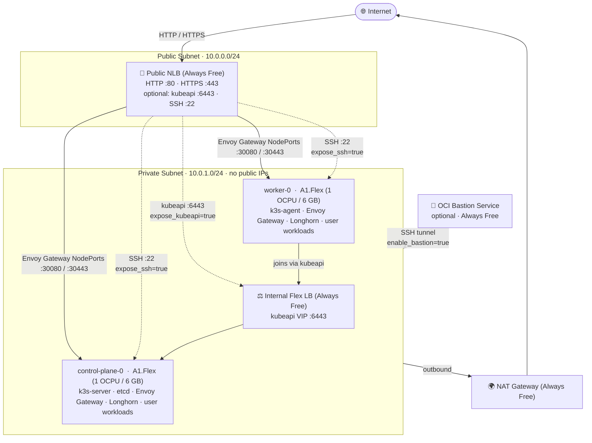

# k3s-oci

[](https://github.com/mbologna/k3s-oci/actions/workflows/ci.yml)

A production-ready [k3s](https://k3s.io) Terraform module for the [OCI Always Free tier](https://docs.oracle.com/en-us/iaas/Content/FreeTier/freetier_topic-Always_Free_Resources.htm).

## Features

- **Single control plane**: 1 control-plane node with embedded etcd + 1 standalone worker (OCI Always Free 2 OCPU / 12 GB limit)
- **Full stack always deployed**: cert-manager, Longhorn, ArgoCD + Image Updater, and kured are always installed; they keep the cluster active and prevent [idle reclamation](#-idle-reclamation)
- **Separate public/private subnets**: k3s nodes have no public IP; only LBs and the optional bastion are internet-facing
- **Envoy Gateway ingress (Gateway API)**: DaemonSet with `system-cluster-critical` priority and `PodDisruptionBudget maxUnavailable: 1`; standard `HTTPRoute`/`Gateway` resources; real client IP preservation via NLB transparent mode
- **Automatic security updates**: `unattended-upgrades` + [kured](https://github.com/kubereboot/kured) drain-reboot-uncordon cycle; zero manual intervention (Ubuntu) or `zypper patch` systemd timers (openSUSE)
- **Configurable OS** (`os_family`): Ubuntu 24.04 LTS (default, OCI-native image auto-resolved) or openSUSE Leap 16.0 (custom-imported UEFI image via `scripts/import-opensuse-aarch64.sh`)
- **k3s version pinned at plan time**: resolved from the GitHub API during `terraform plan`, not at boot time
- **Cluster-scoped IAM**: dynamic group and policy scoped to nodes tagged with the cluster name, not every instance in the compartment
- **Idempotent cloud-init**: all `kubectl` operations use `apply`; re-provisioning is safe
- **Monitoring** (`grafana_hostname`): kube-prometheus-stack (Prometheus + Grafana + Alertmanager) always deployed; optional public Grafana UI via `grafana_hostname`; PrometheusRules for node disk pressure and Longhorn volume health
- **Direct SSH via NLB** (`expose_ssh = true`): expose port 22 on the public NLB restricted to `my_public_ip_cidr`; eliminates the need for OCI Bastion sessions for day-to-day access
- **OCI Vault** (`enable_vault = true`): cluster secrets in a free software-protected OCI Vault; fetched at boot via instance_principal, not embedded in user-data
- **Boot volume backups** (`enable_backup = true`): weekly full backups, 1-week retention, within the 5-backup Always Free limit
- **Object Storage state bucket** (`enable_object_storage_state = true`): versioned OCI Object Storage for Terraform state; S3-compatible endpoint in `terraform_state_backend` output
- **OCI Notifications + Alertmanager** (`enable_notifications = false`): opt-in OCI Notifications topic wired to Alertmanager as a webhook receiver
- **MySQL HeatWave** (`enable_mysql = false`): opt-in Always Free MySQL DB in the private subnet; credentials pre-created as a Kubernetes Secret
- **External DNS** (`enable_external_dns = false`): automatic Cloudflare DNS record management from HTTPRoute hostnames
- **External Secrets** (`enable_external_secrets = false`): sync OCI Vault secrets into Kubernetes Secrets via instance_principal; no credentials to rotate

## Architecture



Both A1.Flex instances live in a **private subnet** with no public IPs. Internet traffic enters exclusively through two Always Free load balancers.

> **k3s naming note:** k3s calls control-plane nodes "servers" (`k3s server`) and workers "agents" (`k3s agent`). Terraform resources follow k3s conventions (`server`/`worker`); in standard Kubernetes terminology these map to control-plane and worker nodes.

**Public NLB** forwards HTTP/HTTPS directly to Envoy Gateway NodePorts on both nodes. `is_preserve_source = true` preserves real client IPs at the hypervisor level. The NLB optionally exposes the Kubernetes API on port 6443, restricted to your IP.

**Internal Flex LB** provides a stable private VIP for the control-plane node. Workers join via this VIP.

**Longhorn** runs on both nodes with `defaultReplicaCount=2`; each PVC is replicated across both nodes. Control-plane `NoSchedule` taints are removed after cluster init so user workloads schedule across both identically-sized nodes.

> **Note:** OCI reduced the A1.Flex Always Free allocation in 2025 from 4 OCPUs/24 GB to 2 OCPUs/12 GB. The topology is now 1 control-plane + 1 standalone worker. etcd is single-node (no HA quorum); the cluster does not tolerate control-plane loss without manual recovery.

## Quickstart

```bash
# 1. Clone the repo
git clone https://github.com/mbologna/k3s-oci.git
cd k3s-oci

# 2. Copy and edit the variables file
cp example/terraform.tfvars.example example/terraform.tfvars
$EDITOR example/terraform.tfvars

# 3. Init and apply (terraform or tofu both work)
cd example && tofu init && tofu apply
```

A `Justfile` is included for common operations (requires [just](https://github.com/casey/just)):

```bash
just init        # tofu init in example/
just plan        # tofu plan in example/
just apply       # tofu apply in example/
just kubeconfig  # fetch kubeconfig via OCI Bastion
just ssh worker  # SSH into a node (server1/server2/server3/worker)
just fmt         # tofu fmt -recursive
```

## kubeconfig

After `terraform apply`, run:

```bash
terraform output kubeconfig_hint
```

This prints the exact steps for your configuration. If `enable_bastion = true` (recommended), the fastest path is the included helper script:

```bash
cd example && ./get-kubeconfig.sh
export KUBECONFIG=~/.kube/k3s-oci.yaml
kubectl get nodes
```

> `enable_bastion` defaults to `true`. It uses OCI Bastion Service, a managed SSH proxy with no VM, no boot volume, and no cost. Without it, nodes are only reachable via OCI serial console (`terraform output kubeconfig_hint` explains all options).

> **Direct SSH (no Bastion):** set `expose_ssh = true` to expose port 22 on the public NLB, restricted to `my_public_ip_cidr`. After apply:
> ```bash
> $(terraform output -raw ssh_command)
> ```
> This is faster than Bastion sessions and avoids session TTLs. When using `expose_ssh = true` you can set `enable_bastion = false` to skip the Bastion Service resource entirely.

## Deploying a web application

### Why TLS is terminated at Envoy Gateway, not at the OCI load balancer

OCI provides two load balancer products with very different capabilities:

| | OCI Network Load Balancer (NLB) | OCI Flexible Load Balancer |
|---|---|---|
| OSI layer | **L4 (TCP passthrough)** | L7 (HTTP/HTTPS aware) |
| TLS termination | ❌ Not possible | ✅ Yes |
| Always Free | **1 NLB** | 1 × 10 Mbps |
| Used here | `nlb.tf`: public internet traffic | `lb.tf`: internal kubeapi HA VIP |

The public-facing load balancer is the **NLB**. It forwards raw TCP streams with `protocol = "TCP"`, so it has no knowledge of TLS, HTTP headers, or certificates. TLS **must** be terminated by something behind it.

The **Flexible LB** *could* terminate TLS, but the one free allocation is already consumed by the kubeapi HA load balancer. Even if it were available, using OCI to manage certificates would break the automatic cert-manager + Let's Encrypt renewal cycle.

The current flow is: Internet → NLB (TCP passthrough, preserves client IPs) → Envoy Gateway NodePort → TLS terminate → route to app pod.

### Minimal example: HTTP-only

No domain needed. Requests to the NLB IP are served directly.

```yaml
# hello-web.yaml
apiVersion: apps/v1
kind: Deployment
metadata:
  name: hello-web
  namespace: hello-web
spec:
  replicas: 2
  selector:
    matchLabels:
      app: hello-web
  template:
    metadata:
      labels:
        app: hello-web
    spec:
      topologySpreadConstraints:
        - maxSkew: 1
          topologyKey: kubernetes.io/hostname
          whenUnsatisfiable: DoNotSchedule
          labelSelector:
            matchLabels:
              app: hello-web
      containers:
        - name: hello-web
          image: httpd:alpine
          ports:
            - containerPort: 80
---
apiVersion: v1
kind: Service
metadata:
  name: hello-web
  namespace: hello-web
spec:
  selector:
    app: hello-web
  ports:
    - port: 80
      targetPort: 80
---
# HTTPRoute — no hostname filter = matches all requests on the http listener
apiVersion: gateway.networking.k8s.io/v1
kind: HTTPRoute
metadata:
  name: hello-web
  namespace: hello-web
spec:
  parentRefs:
    - name: eg
      namespace: envoy-gateway-system
      sectionName: http
  rules:
    - backendRefs:
        - name: hello-web
          port: 80
```

```bash
kubectl create namespace hello-web
kubectl apply -f hello-web.yaml
NLB_IP=$(cd example && tofu output -raw nlb_ip)
curl http://$NLB_IP/
```

### Minimal example: HTTPS with sslip.io (no domain purchase required)

[sslip.io](https://sslip.io) is a public DNS service that resolves `<anything>.<ip>.sslip.io` directly to `<ip>`. Combined with cert-manager + Let's Encrypt HTTP-01, this gives a trusted TLS certificate with zero infrastructure cost.

Replace `<NLB_IP>` with the value of `tofu output -raw nlb_ip`.

```yaml
# hello-web-tls.yaml
---
# 1. Certificate — cert-manager issues this via HTTP-01 challenge through Envoy Gateway
apiVersion: cert-manager.io/v1
kind: Certificate
metadata:
  name: hello-web-tls
  namespace: envoy-gateway-system   # must be in the same namespace as the Gateway
spec:
  secretName: hello-web-tls
  issuerRef:
    name: letsencrypt-prod
    kind: ClusterIssuer
  dnsNames:
    - hello-web.<NLB_IP>.sslip.io
---
# 2. HTTPS listener on the Gateway (add this to gitops/gateway/gateway.yaml for GitOps management)
apiVersion: gateway.networking.k8s.io/v1
kind: Gateway
metadata:
  name: eg
  namespace: envoy-gateway-system
spec:
  gatewayClassName: eg
  listeners:
    - name: http
      port: 80
      protocol: HTTP
      allowedRoutes:
        namespaces:
          from: All
    - name: https-hello-web
      port: 443
      protocol: HTTPS
      hostname: hello-web.<NLB_IP>.sslip.io
      tls:
        mode: Terminate
        certificateRefs:
          - name: hello-web-tls
      allowedRoutes:
        namespaces:
          from: All
---
# 3. HTTP→HTTPS redirect (add hostname to gitops/gateway/redirect.yaml)
apiVersion: gateway.networking.k8s.io/v1
kind: HTTPRoute
metadata:
  name: http-to-https-redirect
  namespace: envoy-gateway-system
spec:
  parentRefs:
    - name: eg
      sectionName: http
  hostnames:
    - hello-web.<NLB_IP>.sslip.io
  rules:
    - filters:
        - type: RequestRedirect
          requestRedirect:
            scheme: https
            statusCode: 301
---
# 4. HTTPRoute for the app — attaches to both listeners
apiVersion: gateway.networking.k8s.io/v1
kind: HTTPRoute
metadata:
  name: hello-web
  namespace: hello-web
spec:
  parentRefs:
    - name: eg
      namespace: envoy-gateway-system
      sectionName: https-hello-web
  hostnames:
    - hello-web.<NLB_IP>.sslip.io
  rules:
    - backendRefs:
        - name: hello-web
          port: 80
```

```bash
# Wait for certificate issuance (typically 1–2 minutes)
kubectl wait --for=condition=Ready certificate/hello-web-tls -n envoy-gateway-system --timeout=5m
curl https://hello-web.<NLB_IP>.sslip.io/
```

> **With a real domain**: set `enable_external_dns = true` and annotate the HTTPRoute with
> `external-dns.alpha.kubernetes.io/hostname: myapp.example.com`. External DNS will create
> the A record automatically, then cert-manager issues the certificate. Alternatively,
> set `enable_dns01_challenge = true` to use DNS-01 (supports wildcard certs and does not
> require inbound port 80).

### Resilience: spread replicas across nodes

Use `topologySpreadConstraints` to ensure pod replicas land on different nodes:

```yaml
spec:
  template:
    spec:
      topologySpreadConstraints:
        - maxSkew: 1
          topologyKey: kubernetes.io/hostname
          whenUnsatisfiable: DoNotSchedule
          labelSelector:
            matchLabels:
              app: <your-app>
```

With 4 identically-sized nodes, 2 replicas survive any single node failure. Envoy Gateway runs as a DaemonSet with `maxUnavailable: 1`, so ingress remains up on the other 3 nodes throughout any single-node drain or failure.

## Monitoring (Grafana + Prometheus)

kube-prometheus-stack (Prometheus, Grafana, Alertmanager) is always deployed as part of the full stack.

### Accessing Grafana

Set `grafana_hostname` in `terraform.tfvars` to expose the Grafana UI with HTTPS and a Let's Encrypt certificate:

```hcl
grafana_hostname = "grafana.example.com"   # or leave null for auto sslip.io hostname
```

When `grafana_hostname` is null, Grafana is reachable at `grafana.<nlb-ip>.sslip.io` (no domain purchase required).

Retrieve the admin credentials after `terraform apply`:

```bash
terraform output -raw grafana_admin_credentials
```

The password is generated by Terraform and stored in OCI Vault when `enable_vault = true`; it is never embedded in cloud-init user-data.

### Built-in alert rules

The following PrometheusRules are included out of the box (`gitops/monitoring/prometheus-rules.yaml`):

| Alert | Condition |
|---|---|
| `NodeDiskPressure` | Node has disk pressure condition |
| `NodeDiskSpaceLow` | < 15% free disk on any node |
| `NodeDiskSpaceCritical` | < 5% free disk on any node |
| `LonghornVolumeDegraded` | Longhorn volume in degraded state |
| `LonghornVolumeFaulted` | Longhorn volume in faulted state |
| `LonghornNodeStorageWarning` | Longhorn node storage > 80% used |

### Adding custom dashboards

Create a ConfigMap in the `monitoring` namespace with label `grafana_dashboard: "1"` — the Grafana sidecar auto-discovers and loads it:

```yaml
apiVersion: v1
kind: ConfigMap
metadata:
  name: my-dashboard
  namespace: monitoring
  labels:
    grafana_dashboard: "1"
data:
  my-dashboard.json: |
    { ... }   # Grafana dashboard JSON
```

## GitOps — App of Apps

The `gitops/` directory contains ArgoCD `Application` manifests managed with the [App of Apps pattern](https://argo-cd.readthedocs.io/en/stable/operator-manual/cluster-bootstrapping/#app-of-apps-pattern).

After the cluster is running, bootstrap it:

```bash
kubectl apply -n argocd -f gitops/apps/app-of-apps.yaml
```

ArgoCD will then continuously reconcile every manifest under `gitops/apps/`.

### Adding your own applications

This repo is designed to be forked. To add your own apps on top of the built-in stack:

1. **Fork this repo** on GitHub.

2. **Update all `repoURL` references** to point to your fork:
   ```bash
   bash gitops/update-repo-url.sh https://github.com/your-org/your-fork.git
   git add gitops/apps/ && git commit -m "chore: update gitops repoURL"
   git push
   ```

3. **Add your ArgoCD `Application` manifests** to `gitops/apps/` — ArgoCD syncs them automatically. Each app can point at any Helm chart registry or any Git repository.

> **Deploying for the first time?** Also set `gitops_repo_url` in `terraform.tfvars` before running `tofu apply`, so cloud-init writes the correct fork URL at bootstrap:
> ```hcl
> gitops_repo_url = "https://github.com/your-org/your-fork.git"
> ```
> **Already have a running cluster?** Patch the App of Apps directly:
> ```bash
> argocd app set app-of-apps --repo https://github.com/your-org/your-fork.git
> ```

> **Private repos**: set `gitops_ssh_private_key` in `terraform.tfvars` with your SSH private key — Terraform stores it in OCI Vault automatically and cloud-init creates the `argocd-repo-gitops` Secret before ArgoCD starts. No manual `argocd repo add` step needed. For repos with a non-standard directory layout, set `gitops_path` (default: `gitops/apps`).

## Automatic updates & reboots (unattended-upgrades + kured)

`unattended-upgrades` applies Ubuntu security patches daily and sets `/var/run/reboot-required` when a kernel update needs a reboot.

[kured](https://github.com/kubereboot/kured) watches every node for `/var/run/reboot-required` and, when found:
1. Acquires a cluster-wide lock (only one node reboots at a time)
2. Cordons + drains the node
3. Reboots
4. Waits for the node to return and uncordons it

This keeps the cluster fully patched with zero manual intervention and no concurrent downtime.

## Dependency updates (Renovate)

[Renovate](https://docs.renovatebot.com) tracks Terraform providers, k3s, all stack component versions (via `# renovate:` inline comments in `vars.tf` and `gitops/apps/*.yaml`), and GitHub Actions. Enable with the [Renovate GitHub App](https://github.com/apps/renovate) or the self-hosted workflow at `.github/workflows/renovate.yml` (requires a `RENOVATE_TOKEN` secret with `repo` scope).

## Remote Terraform state (OCI Object Storage)

With `enable_object_storage_state = true` (the default), a versioned OCI Object Storage bucket is created automatically. After `terraform apply`, get the ready-to-use backend config:

```bash
terraform output -json terraform_state_backend
```

Use it in your `terraform { backend "s3" {} }` block (requires an OCI Customer Secret Key for S3 credentials):

```hcl
terraform {
  backend "s3" {
    bucket                      = "<cluster_name>-terraform-state"
    key                         = "terraform.tfstate"
    region                      = "<your-region>"                     # e.g. eu-frankfurt-1
    endpoint                    = "https://<namespace>.compat.objectstorage.<region>.oraclecloud.com"
    skip_region_validation      = true
    skip_credentials_validation = true
    skip_metadata_api_check     = true
    force_path_style            = true
  }
}
```

> Generate OCI Customer Secret Keys under **Identity → Users → your user → Customer Secret Keys**. The bucket name and namespace endpoint are in `terraform output terraform_state_backend`.

## Always Free budget

| Resource | Free allowance | This module |
|---|---|---|
| A1.Flex compute | 2 OCPUs / 12 GB / 2 instances | 1 server + 1 worker = **2 OCPUs / 12 GB** |
| Block storage | 200 GB | 2 × 50 GB = **100 GB** (100 GB spare) |
| Network Load Balancer | 1 NLB | **1** (public, HTTP/HTTPS) |
| Flexible Load Balancer | 1 × 10 Mbps | **1** (private, kubeapi) |
| E2.1.Micro instances | 2 | **0** (bastion uses OCI Bastion Service, managed, no VM) |
| NAT Gateway | 1 per VCN | **1** (outbound-only for private nodes) |
| Object Storage | 20 GB | **2 versioned buckets**: Terraform state + Longhorn PVC backups (`enable_object_storage_state`, `enable_longhorn_backup`) |
| Vault (shared) | Software keys + 150 secrets | **3 secrets**: k3s_token, longhorn_ui_password, grafana_admin_password (`enable_vault = true`) |
| Volume backups | 5 total | **2** (one per node, weekly, 1-week retention) (`enable_backup = true`) |
| Notifications | 1M HTTPS + 1K email/month | **1 topic** wired to Alertmanager (`enable_notifications = false`, opt-in) |
| MySQL HeatWave | 1 standalone DB, 50 GB | **1 DB system** in private subnet (`enable_mysql = false`, opt-in) |

> ⚠️ **Idle reclamation** <a name="-idle-reclamation"></a>: OCI reclaims Always Free instances where CPU, network, and memory stay below 20% for 7 consecutive days. The full stack (Longhorn, ArgoCD, cert-manager, kured) generates enough background activity to keep the cluster alive.

## Failure tolerance

| Component | Tolerance | What happens on failure |
|---|---|---|
| **Worker node failure** | ✅ Full | Workloads reschedule to control-plane (taints removed); Longhorn (2 replicas) keeps storage up |
| **Control-plane failure** | ❌ None | Single etcd node — cluster becomes unavailable; restore from etcd snapshot; see [Split-Brain Recovery](#split-brain-recovery) |
| **HTTP/HTTPS ingress** | ✅ Worker loss | Envoy Gateway DaemonSet on control-plane keeps ingress up |
| **Kubernetes API** | ❌ CP loss | Single control-plane; ILB has no failover target |
| **PVC data (Longhorn)** | ✅ 1 node | 2 replicas across 2 nodes; 1 replica lost, 1 remains serving |
| **cert-manager** | ⚠️ Soft | Pod reschedules within minutes; TLS serving unaffected (certs live in Secrets); only new issuance/renewal is paused |
| **ArgoCD** | ⚠️ Soft | GitOps sync pauses until rescheduled; running workloads unaffected |
| **MySQL (if enabled)** | ❌ None | Always Free tier = single OCI-managed instance; no HA failover |

## Node roles and workload placement

Each A1.Flex instance has identical resources (1 OCPU / 6 GB RAM). The k3s role (server vs agent) affects which system processes run, not how much resource is available for workloads.

| What | control-plane-0 | worker-0 | Scheduling mechanism |
|---|:---:|:---:|---|
| **etcd** | ✅ | ❌ | k3s built-in; servers only |
| **Kubernetes API server** | ✅ | ❌ | k3s built-in; servers only |
| **Envoy Gateway** (ingress) | ✅ | ✅ | DaemonSet (1 pod per node) |
| **Longhorn** (storage daemon) | ✅ | ✅ | DaemonSet (1 pod per node) |
| **cert-manager** | ✅ | ✅ | Deployment: schedules on any node |
| **ArgoCD** | ✅ | ✅ | Deployment: schedules on any node |
| **kube-prometheus-stack** | ✅ | ✅ | Deployment/StatefulSet: any node |
| **kured** | ✅ | ✅ | DaemonSet (1 pod per node) |
| **User workloads** | ✅ | ✅ | No restrictions — schedules on both nodes |

> **Why control-plane runs user workloads:** k3s ≥ 1.24 automatically taints control-plane nodes with `NoSchedule`. This setup removes that taint at cluster init so both identically-sized nodes are available.
>
> **Recommendation:** use `replicas ≥ 2` with `topologySpreadConstraints` (see [gitops/README.md](gitops/README.md#resilience-spread-replicas-across-nodes)) to spread pods across nodes.

## Why this topology

OCI reduced the A1.Flex Always Free allocation in 2025 from 4 OCPUs/24 GB to **2 OCPUs/12 GB** (max 2 instances). The result is 1 control-plane + 1 standalone worker — no etcd HA, but full use of the free allocation.

### Topology comparison

| Topology | etcd HA | Nodes for workloads | Effective RAM for workloads† | Assessment |
|---|:---:|:---:|:---:|---|
| **1 CP + 1 worker (this module)** | ❌ Single node | 2 (taints removed) | ~10 GB | **Only viable option** within 2 OCPU / 12 GB Always Free limit |
| 2 CP + 0 workers | ❌ 2-node etcd invalid | 2 | ~9 GB | 2-node etcd cannot form quorum; worse than 1 node |

†etcd + kubeapi consume ~300–500 MB RAM and ~100–200m CPU per control-plane node.

### Why not use the 2 free E2.1.Micro instances as extra workers?

Always Free also includes 2 AMD E2.1.Micro instances. They are not worth adding:

1. **1 GB RAM**: k3s agent + Longhorn DaemonSet alone consume ~700–800 MB, leaving ~200 MB for user workloads
2. **1/8 OCPU**: negligible compute; adds operational complexity for near-zero workload benefit

### Previously rejected alternatives

| Alternative | Why it was rejected |
|---|---|
| nginx stream proxy in front of Envoy Gateway | Extra latency and complexity; NLB already preserves source IPs directly |
| OCI Bastion VM (E2.1.Micro) | OCI Bastion Service provides managed SSH proxying for free with no VM, no OS to patch, and no boot volume consuming storage budget |
| Boot volumes < 50 GB | OCI hard minimum is 50 GB per shape; 2 × 50 GB = 100 GB of the 200 GB free block storage allowance |
| Additional NLB for kubeapi | Only 1 NLB is Always Free; the existing NLB conditionally exposes port 6443 via `expose_kubeapi = true` |
| openSUSE (or other non-Ubuntu Linux) as the base OS | OCI provides no native openSUSE ARM platform image. **openSUSE Leap 16.0 is now supported** via `os_family = "opensuse"` + a custom-imported UEFI image. See [Choosing an OS](#choosing-an-os) below. Other distros remain unsupported. |

### Choosing an OS

The module supports two OS families, selected via `os_family`:

| `os_family` | Image | Auto-resolved | SSH user | Auto-updates |
|---|---|---|---|---|
| `"ubuntu"` (default) | Ubuntu 24.04 LTS (Noble) aarch64 | ✅ Yes (latest OCI-native image) | `ubuntu` | `unattended-upgrades` + `needrestart` |
| `"opensuse"` | openSUSE Leap 16.0 Minimal VM aarch64 | ❌ No (must import and set `os_image_id`) | `sles` | `zypper patch` systemd timers |

#### Ubuntu (default)

No extra steps needed. The latest Ubuntu 24.04 LTS image for `VM.Standard.A1.Flex` is resolved automatically at plan time from the tenancy.

#### openSUSE Leap 16.0

OCI has no native openSUSE image. Use the included script to import one before running `tofu apply`:

```bash
./scripts/import-opensuse-aarch64.sh
```

The script:
1. Resolves the latest openSUSE Leap 16.0 Minimal VM Cloud aarch64 QCOW2 from `download.opensuse.org`
2. Streams the image (~271 MiB) directly into a temporary OCI Object Storage bucket — no local disk required
3. Imports via the OCI REST API with `firmware: UEFI_64` and `launchMode: CUSTOM`
   (the OCI CLI's `oci compute image import` always defaults to BIOS; `UEFI_64` is required for `VM.Standard.A1.Flex`)
4. Adds `VM.Standard.A1.Flex` shape compatibility
5. Cleans up the temp Object Storage object
6. Prints the image OCID

Then set in `terraform.tfvars`:

```hcl
os_family   = "opensuse"
os_image_id = "ocid1.image.oc1..."   # OCID printed by the script above
```

**Script options:**

```
--compartment-id OCID   Compartment OCID (default: tenancy root)
--region REGION         OCI region (default: from ~/.oci/config)
--leap-version VERSION  openSUSE Leap version (default: 16.0)
--bucket-name NAME      Temp bucket name (default: opensuse-image-import-tmp)
--keep-bucket           Do not delete the QCOW2 object after import
--image-name NAME       Custom display name for the imported image
```

**Prerequisites:** OCI CLI configured (`~/.oci/config`), `curl`, `python3`.

**Known caveats (verified with Leap 16.0 + VM.Standard.A1.Flex):**

| Caveat | Detail |
|---|---|
| **Image must be re-imported on new Leap releases** | No auto-update path for the base OS image; re-run the script and update `os_image_id` when a new build is published |
| **UEFI_64 required at import time** | OCI's `oci compute image import` CLI hard-codes `firmware: BIOS`. The script works around this via a direct REST API call |
| **Shape compatibility not auto-detected** | OCI does not auto-detect the architecture of imported QCOW2 images; the script adds `VM.Standard.A1.Flex` explicitly |
| **Oracle Cloud Agent (OCA) unavailable** | No OCI-native monitoring agent on custom images |

#### Using any other OS image

Set `os_image_id` to the OCID of any OCI image. **Only Ubuntu and openSUSE are tested.** Any other OS will need its own bootstrap logic — fork the repo and adapt `files/lib/bootstrap-ubuntu.sh` as a starting point.


## Split-Brain Recovery

A **split-brain** occurs when multiple k3s server nodes each bootstrap an independent etcd cluster (`--cluster-init`) instead of joining a single shared one. Symptoms: `kubectl get nodes` shows only 1 node (not 3), or etcd member IDs differ across servers, or the cluster survives a reboot but each server has different state.

### Detection

```bash
# On each server node (via SSH):
sudo k3s kubectl get nodes          # should show all 3 servers
sudo k3s etcd-snapshot ls           # should show same snapshots on all servers
/usr/local/bin/k3s etcd-snapshot ls 2>&1 | grep -E "^etcd"

# Check etcd member list (run on each server):
sudo ETCDCTL_API=3 \
  ETCDCTL_CACERT=/var/lib/rancher/k3s/server/tls/etcd/server-ca.crt \
  ETCDCTL_CERT=/var/lib/rancher/k3s/server/tls/etcd/server-client.crt \
  ETCDCTL_KEY=/var/lib/rancher/k3s/server/tls/etcd/server-client.key \
  etcdctl member list
# If IDs differ between servers → split-brain confirmed
```

### Recovery from etcd snapshot (recommended)

```bash
# 1. Identify the best snapshot. List snapshots in OCI Object Storage:
#    (if enable_etcd_snapshots = true, snapshots are uploaded every 6h)
oci os object list \
  --namespace <your-namespace> \
  --bucket-name <cluster-name>-terraform-state \
  --prefix "etcd-snapshots/<cluster-name>/" \
  --query 'sort_by(data, &"time-created")[-1]."name"' --raw-output

# 2. Download the best snapshot to the elected first server:
oci os object get \
  --namespace <your-namespace> \
  --bucket-name <cluster-name>-terraform-state \
  --name etcd-snapshots/<cluster-name>/<snapshot-file> \
  --file /tmp/etcd-restore.db

# 3. Stop k3s on ALL server nodes:
sudo systemctl stop k3s

# 4. On the first server: reset etcd and restore from snapshot.
#    WARNING: this wipes all current etcd state on this node.
sudo k3s server --cluster-reset \
  --cluster-reset-restore-path=/tmp/etcd-restore.db &
# Wait for the reset to complete (watch journalctl -u k3s), then stop it:
sudo pkill -f "k3s server --cluster-reset"

# 5. On the REMAINING server nodes: wipe local etcd data and re-join.
#    WARNING: this wipes all etcd state on these nodes (they will re-sync from step 4).
sudo rm -rf /var/lib/rancher/k3s/server/db/
sudo rm -f  /var/lib/rancher/k3s/server/token

# 6. Start k3s on the first server first:
sudo systemctl start k3s
sleep 30  # wait for it to become the etcd leader

# 7. Start k3s on the remaining servers (they will join the restored cluster):
sudo systemctl start k3s  # (on each remaining server)

# 8. Verify all members rejoined:
sudo k3s kubectl get nodes
```

### Recovery without snapshot (last resort)

```bash
# 1. Stop k3s on ALL server nodes.
# 2. On the intended first server ONLY, reset with no snapshot:
sudo k3s server --cluster-reset &
# Wait, then stop it.
# 3. Wipe db/ and token on remaining servers (same as step 5 above).
# 4. Start the first server, wait 30s, then start the others.
# Note: without a snapshot you lose all etcd state from the previous cluster.
```

### Deleting a stale leader lock (after full rebuild)

```bash
# If cloud-init aborts with "leader lock held by running instance" after a
# tofu destroy + tofu apply, the old lock is still in Object Storage.
# Delete it before re-applying, or it will be cleared automatically if the
# holder instance is no longer RUNNING.
oci os object delete \
  --namespace <your-namespace> \
  --bucket-name <cluster-name>-terraform-state \
  --name cluster-init-lock \
  --force
```

## NLB IP stability

The public NLB has `prevent_destroy = true` so its IP is stable across `tofu apply` runs.
However, if the NLB is **ever recreated** (e.g. after `tofu state rm` + re-apply):

- All `sslip.io` hostnames change (e.g. `grafana.<old-ip>.sslip.io` → `grafana.<new-ip>.sslip.io`)
- Let's Encrypt certificates are invalid for the new hostnames and must be reissued
- With a custom domain + `enable_external_dns = true`, ExternalDNS updates DNS automatically and cert-manager auto-renews

**If using sslip.io defaults**, run `tofu apply` again after NLB recreation: `local.grafana_hostname` and `local.argocd_hostname` recompute automatically from the new IP, cloud-init re-creates the Gateway listeners and certificates, and cert-manager reissues via Let's Encrypt.

> The first-server TIMECREATED election is stable in practice but not contractually guaranteed when pool instances share the same creation timestamp. In the rare case of a timestamp tie, `jq | first` returns a stable (but undefined) ordering based on API response. The atomic leader lock (`cluster-init-lock` in the state bucket) provides the final safety guarantee independent of election ordering.

## License

MIT. See [LICENSE](LICENSE).

## Variables

<!-- BEGIN_TF_DOCS -->
## Inputs

| Name | Description | Type | Default | Required |
|------|-------------|------|---------|:--------:|
| <a name="input_alertmanager_email"></a> [alertmanager\_email](#input\_alertmanager\_email) | Optional email address to subscribe to the OCI Notifications topic. The subscriber must confirm via an OCI confirmation email. | `string` | `null` | no |
| <a name="input_argocd_chart_version"></a> [argocd\_chart\_version](#input\_argocd\_chart\_version) | ArgoCD Helm chart version used for the bootstrap install. Must match gitops/apps/argocd.yaml targetRevision. Managed by Renovate. | `string` | `"9.7.1"` | no |
| <a name="input_argocd_hostname"></a> [argocd\_hostname](#input\_argocd\_hostname) | Fully-qualified hostname for the ArgoCD UI (e.g. argocd.example.com). When set, a Gateway API HTTPRoute with a cert-manager TLS certificate is created by cloud-init. If null, an sslip.io hostname is derived from the NLB IP. | `string` | `null` | no |
| <a name="input_availability_domain"></a> [availability\_domain](#input\_availability\_domain) | Availability domain name, e.g. 'Uocm:EU-FRANKFURT-1-AD-1' | `string` | n/a | yes |
| <a name="input_boot_volume_size_in_gbs"></a> [boot\_volume\_size\_in\_gbs](#input\_boot\_volume\_size\_in\_gbs) | Boot volume size in GB for k3s nodes (servers + workers). OCI minimum is 50 GB for all shapes. With 2 k3s nodes at 50 GB each the total is 100 GB (within the 200 GB Always Free block storage limit). The bastion uses OCI Bastion Service — no VM, no boot volume. | `number` | `50` | no |
| <a name="input_certmanager_chart_version"></a> [certmanager\_chart\_version](#input\_certmanager\_chart\_version) | cert-manager Helm chart version used for the bootstrap install. Must match gitops/apps/cert-manager.yaml targetRevision. Managed by Renovate. | `string` | `"v1.20.3"` | no |
| <a name="input_certmanager_email_address"></a> [certmanager\_email\_address](#input\_certmanager\_email\_address) | Email address for Let's Encrypt ACME registration. Must be a real address. | `string` | n/a | yes |
| <a name="input_cloudflare_api_token"></a> [cloudflare\_api\_token](#input\_cloudflare\_api\_token) | Cloudflare API token. Required when enable\_external\_dns = true or enable\_dns01\_challenge = true. Create a scoped token at https://dash.cloudflare.com/profile/api-tokens with Zone:DNS:Edit permissions. | `string` | `null` | no |
| <a name="input_cloudflare_zone_id"></a> [cloudflare\_zone\_id](#input\_cloudflare\_zone\_id) | Cloudflare Zone ID for the managed domain. Required when enable\_external\_dns = true. | `string` | `null` | no |
| <a name="input_cluster_name"></a> [cluster\_name](#input\_cluster\_name) | Logical name for the cluster. Used in display names and freeform tags. | `string` | n/a | yes |
| <a name="input_compartment_ocid"></a> [compartment\_ocid](#input\_compartment\_ocid) | OCID of the compartment where all resources are created | `string` | n/a | yes |
| <a name="input_compute_shape"></a> [compute\_shape](#input\_compute\_shape) | OCI compute shape for k3s nodes | `string` | `"VM.Standard.A1.Flex"` | no |
| <a name="input_dockerhub_password"></a> [dockerhub\_password](#input\_dockerhub\_password) | Docker Hub access token (PAT) for ArgoCD OCI Helm chart pulls. Paired with dockerhub\_username. | `string` | `""` | no |
| <a name="input_dockerhub_username"></a> [dockerhub\_username](#input\_dockerhub\_username) | Docker Hub username for ArgoCD to authenticate when pulling OCI Helm charts (e.g. Envoy Gateway from registry-1.docker.io). If empty, anonymous pulls are attempted and may be rate-limited. Create a PAT at https://app.docker.com/settings/personal-access-tokens | `string` | `""` | no |
| <a name="input_enable_backup"></a> [enable\_backup](#input\_enable\_backup) | Enable weekly boot volume backups for all k3s nodes (Always Free: 5 total backups). With 2 nodes at weekly-1-week-retention there are at most 2 active backups. | `bool` | `true` | no |
| <a name="input_enable_bastion"></a> [enable\_bastion](#input\_enable\_bastion) | Provision an OCI Bastion Service resource (managed SSH proxy, Always Free, no storage).<br/>When enabled, a STANDARD bastion is created and associated with the private subnet.<br/>Use example/get-kubeconfig.sh to retrieve kubeconfig via a Bastion session.<br/>Strongly recommended; without it, nodes are reachable only via serial console. | `bool` | `true` | no |
| <a name="input_enable_dns01_challenge"></a> [enable\_dns01\_challenge](#input\_enable\_dns01\_challenge) | Configure cert-manager ClusterIssuers to use DNS-01 ACME challenge via Cloudflare instead of HTTP-01. Enables wildcard certificates (*.example.com) and works even without inbound port 80. Requires cloudflare\_api\_token. | `bool` | `false` | no |
| <a name="input_enable_etcd_snapshots"></a> [enable\_etcd\_snapshots](#input\_enable\_etcd\_snapshots) | Upload etcd snapshots to the OCI Object Storage state bucket every 6 hours using OCI CLI instance\_principal auth (no Customer Secret Keys required). Requires enable\_object\_storage\_state = true. Provides off-node etcd backup for split-brain recovery. | `bool` | `true` | no |
| <a name="input_enable_external_dns"></a> [enable\_external\_dns](#input\_enable\_external\_dns) | Deploy external-dns (kubernetes-sigs) configured for Cloudflare. Automatically creates/updates DNS A records when Services or Ingresses are annotated. Requires cloudflare\_api\_token and cloudflare\_zone\_id. | `bool` | `false` | no |
| <a name="input_enable_external_secrets"></a> [enable\_external\_secrets](#input\_enable\_external\_secrets) | Deploy the External Secrets Operator and create a ClusterSecretStore backed by OCI Vault (instance\_principal auth). Requires enable\_vault = true. Workloads can then create ExternalSecret resources to sync any OCI Vault secret into a Kubernetes Secret without hard-coding values. | `bool` | `false` | no |
| <a name="input_enable_longhorn_backup"></a> [enable\_longhorn\_backup](#input\_enable\_longhorn\_backup) | Provision a dedicated Always Free OCI Object Storage bucket for Longhorn PVC backups. Cloud-init automatically creates the backup credentials secret and wires the Longhorn BackupTarget when enable\_longhorn\_backup = true AND user\_ocid is set. Shares the 20 GB free allowance with the Terraform state bucket. | `bool` | `true` | no |
| <a name="input_enable_mysql"></a> [enable\_mysql](#input\_enable\_mysql) | Provision an Always Free MySQL HeatWave DB system (single node, 50 GB). Creates a Kubernetes Secret 'mysql-credentials' in the default namespace. | `bool` | `false` | no |
| <a name="input_enable_notifications"></a> [enable\_notifications](#input\_enable\_notifications) | Create an OCI Notifications topic and wire the endpoint to Alertmanager as a webhook receiver<br/>(Always Free: 1M HTTPS + 1K email/month).<br/><br/>⚠️  IMPORTANT — ONS authentication limitation: The OCI Notifications PublishMessage REST endpoint<br/>requires OCI IAM request signing. Alertmanager sends unsigned HTTP POSTs, which OCI rejects with<br/>HTTP 401. Enabling this variable creates the ONS topic and records its endpoint in the<br/>'notification\_topic\_endpoint' output, but alerts will NOT be delivered to ONS without a signing proxy.<br/><br/>Workarounds (choose one):<br/>  (a) Use Alertmanager's native 'email\_configs' receiver with an SMTP relay — no proxy needed.<br/>  (b) Deploy a small signing proxy (e.g. an OCI Function with instance-principal auth) between<br/>      Alertmanager and the ONS endpoint.<br/>  (c) Use a third-party webhook receiver (PagerDuty, Slack, etc.) that does not require signing.<br/><br/>The 'alertmanager\_email' variable provides a direct ONS email subscription — this works correctly<br/>and is independent of the signing limitation (OCI delivers email subscriptions internally). | `bool` | `false` | no |
| <a name="input_enable_object_storage_state"></a> [enable\_object\_storage\_state](#input\_enable\_object\_storage\_state) | Provision an Always Free OCI Object Storage bucket for storing Terraform/OpenTofu state (S3-compatible API). See the terraform\_state\_backend output for the backend configuration snippet. | `bool` | `true` | no |
| <a name="input_enable_oci_logging"></a> [enable\_oci\_logging](#input\_enable\_oci\_logging) | Enable OCI Logging for cloud-init logs. Ships /var/log/k3s-cloud-init.log to OCI Logging Service via the Unified Monitoring Agent (Always Free: 10 GB/month). | `bool` | `true` | no |
| <a name="input_enable_tailscale"></a> [enable\_tailscale](#input\_enable\_tailscale) | Store Tailscale Kubernetes operator OAuth credentials in OCI Vault so the<br/>tailscale-operator ExternalSecret can sync them into the cluster without<br/>committing secrets to git. Requires enable\_vault = true.<br/>Pre-requisite: create an OAuth client at https://login.tailscale.com/admin/settings/oauth<br/>with scope Devices → Write (devices:core:write) and allowed tag tag:k8s-operator. | `bool` | `false` | no |
| <a name="input_enable_vault"></a> [enable\_vault](#input\_enable\_vault) | Store cluster secrets (k3s\_token, longhorn\_ui\_password, grafana\_admin\_password) in OCI Vault (Always Free: software keys + 150 secrets). Nodes fetch secrets via OCI CLI instance\_principal at boot — plaintext values are removed from cloud-init user-data. | `bool` | `true` | no |
| <a name="input_environment"></a> [environment](#input\_environment) | Deployment environment label (e.g. staging, production) | `string` | `"staging"` | no |
| <a name="input_etcd_snapshot_retention"></a> [etcd\_snapshot\_retention](#input\_etcd\_snapshot\_retention) | Number of etcd snapshots to retain in OCI Object Storage per node. Older snapshots are pruned automatically by the cron job. Must be >= 1 (0 would disable pruning and grow the bucket unbounded). | `number` | `5` | no |
| <a name="input_expose_kubeapi"></a> [expose\_kubeapi](#input\_expose\_kubeapi) | Expose the Kubernetes API server via the public NLB (restricted to my\_public\_ip\_cidr) | `bool` | `false` | no |
| <a name="input_expose_ssh"></a> [expose\_ssh](#input\_expose\_ssh) | Expose SSH (port 22) via the public NLB to all cluster nodes (restricted to my\_public\_ip\_cidr). Eliminates the need for OCI Bastion sessions for day-to-day access. | `bool` | `false` | no |
| <a name="input_external_dns_domain_filter"></a> [external\_dns\_domain\_filter](#input\_external\_dns\_domain\_filter) | Domain filter for external-dns — only DNS records under this domain are managed (e.g. 'k3s.example.com'). Required when enable\_external\_dns = true. | `string` | `null` | no |
| <a name="input_external_secrets_chart_version"></a> [external\_secrets\_chart\_version](#input\_external\_secrets\_chart\_version) | External Secrets Operator Helm chart version used for the bootstrap install. Must match gitops/apps/external-secrets.yaml targetRevision. Managed by Renovate. | `string` | `"2.6.0"` | no |
| <a name="input_fault_domains"></a> [fault\_domains](#input\_fault\_domains) | Fault domains to spread the instance pool across | `list(string)` | <pre>[<br/>  "FAULT-DOMAIN-1",<br/>  "FAULT-DOMAIN-2",<br/>  "FAULT-DOMAIN-3"<br/>]</pre> | no |
| <a name="input_gateway_api_version"></a> [gateway\_api\_version](#input\_gateway\_api\_version) | Kubernetes Gateway API CRDs version (experimental channel) installed at bootstrap. Experimental channel is a superset of standard and includes GRPCRoute, TCPRoute, TLSRoute, etc. required by Envoy Gateway. Must exist before ArgoCD syncs gateway-config. | `string` | `"v1.5.1"` | no |
| <a name="input_github_ssh_keys_username"></a> [github\_ssh\_keys\_username](#input\_github\_ssh\_keys\_username) | GitHub username whose published SSH keys (https://github.com/<username>.keys)<br/>are added to every instance's authorized\_keys at plan time, in addition to<br/>the primary public\_key / public\_key\_path. Leave empty to skip. | `string` | `""` | no |
| <a name="input_gitops_path"></a> [gitops\_path](#input\_gitops\_path) | Path within gitops\_repo\_url that ArgoCD uses as the App of Apps source. Default is 'gitops/apps' (k3s-oci native layout). Override when your GitOps repo uses a different directory structure. | `string` | `"gitops/apps"` | no |
| <a name="input_gitops_repo_url"></a> [gitops\_repo\_url](#input\_gitops\_repo\_url) | Git repository URL for the ArgoCD App of Apps (e.g. https://github.com/your-org/k3s-oci.git). Set this to your fork so ArgoCD pulls from the right repo. | `string` | `"https://github.com/mbologna/k3s-oci.git"` | no |
| <a name="input_gitops_ssh_private_key"></a> [gitops\_ssh\_private\_key](#input\_gitops\_ssh\_private\_key) | SSH private key (PEM/OpenSSH format) for ArgoCD to clone the gitops repo. Terraform stores it in OCI Vault; cloud-init fetches it and creates the argocd-repo-gitops Secret before ArgoCD starts. Leave empty only when gitops\_repo\_url is a public HTTPS repo. | `string` | `""` | no |
| <a name="input_grafana_hostname"></a> [grafana\_hostname](#input\_grafana\_hostname) | Fully-qualified hostname for the Grafana UI (e.g. grafana.example.com). When set, a Gateway API HTTPRoute with a cert-manager TLS certificate is created in gitops/monitoring/. | `string` | `null` | no |
| <a name="input_http_lb_port"></a> [http\_lb\_port](#input\_http\_lb\_port) | Public HTTP port on the NLB frontend (default 80). | `number` | `80` | no |
| <a name="input_https_lb_port"></a> [https\_lb\_port](#input\_https\_lb\_port) | Public HTTPS port on the NLB frontend (default 443). | `number` | `443` | no |
| <a name="input_ingress_controller_http_nodeport"></a> [ingress\_controller\_http\_nodeport](#input\_ingress\_controller\_http\_nodeport) | NodePort on workers that the ingress controller binds for HTTP traffic | `number` | `30080` | no |
| <a name="input_ingress_controller_https_nodeport"></a> [ingress\_controller\_https\_nodeport](#input\_ingress\_controller\_https\_nodeport) | NodePort on workers that the ingress controller binds for HTTPS traffic | `number` | `30443` | no |
| <a name="input_k3s_server_pool_size"></a> [k3s\_server\_pool\_size](#input\_k3s\_server\_pool\_size) | Number of k3s control-plane nodes in the instance pool. Always Free allows only 1 (2 OCPUs / 12 GB total split with the standalone worker). Must be an odd number >= 1. | `number` | `1` | no |
| <a name="input_k3s_standalone_worker"></a> [k3s\_standalone\_worker](#input\_k3s\_standalone\_worker) | When true (default), provisions one worker node as a plain oci\_core\_instance resource.<br/>This is the recommended approach for OCI Always Free tenancies: instance pools route<br/>requests through OCI Capacity Management which can fail for A1.Flex shapes, whereas<br/>a direct oci\_core\_instance reliably claims the free allocation.<br/>Default topology: 1 control-plane node (pool) + 1 standalone worker = 2 OCPUs / 12 GB. | `bool` | `true` | no |
| <a name="input_k3s_subnet"></a> [k3s\_subnet](#input\_k3s\_subnet) | Subnet name used to derive the flannel interface. Leave 'default\_route\_table' to let k3s auto-detect. | `string` | `"default_route_table"` | no |
| <a name="input_k3s_version"></a> [k3s\_version](#input\_k3s\_version) | k3s version to install. Use 'stable' or 'latest' to resolve from the k3s channel API at plan-time, or pin to a specific release (e.g. 'v1.35.5+k3s1'). | `string` | `"stable"` | no |
| <a name="input_k3s_worker_pool_size"></a> [k3s\_worker\_pool\_size](#input\_k3s\_worker\_pool\_size) | Number of k3s worker nodes managed by the OCI Instance Pool.<br/>Set to 0 (default) when using k3s\_standalone\_worker = true, which is the recommended<br/>Always Free topology. The pool is kept to allow future scaling beyond the free tier. | `number` | `0` | no |
| <a name="input_kube_api_port"></a> [kube\_api\_port](#input\_kube\_api\_port) | Port the k3s API server listens on | `number` | `6443` | no |
| <a name="input_longhorn_hostname"></a> [longhorn\_hostname](#input\_longhorn\_hostname) | Fully-qualified hostname for the Longhorn UI (e.g. longhorn.example.com). When set, a Gateway API HTTPRoute with BasicAuth (Envoy Gateway SecurityPolicy) and a cert-manager TLS certificate is created. | `string` | `null` | no |
| <a name="input_longhorn_ui_username"></a> [longhorn\_ui\_username](#input\_longhorn\_ui\_username) | Username for Longhorn UI BasicAuth (only used when longhorn\_hostname is set). | `string` | `"admin"` | no |
| <a name="input_my_public_ip_cidr"></a> [my\_public\_ip\_cidr](#input\_my\_public\_ip\_cidr) | Your workstation public IP in CIDR notation (e.g. 1.2.3.4/32).<br/>Restricts OCI Bastion Service session creation (enable\_bastion = true) and<br/>kubeapi access via the public NLB (expose\_kubeapi = true).<br/>k3s nodes are in a private subnet and are only reachable via OCI Bastion sessions. | `string` | n/a | yes |
| <a name="input_mysql_admin_username"></a> [mysql\_admin\_username](#input\_mysql\_admin\_username) | Admin username for the MySQL HeatWave DB system. | `string` | `"admin"` | no |
| <a name="input_mysql_shape"></a> [mysql\_shape](#input\_mysql\_shape) | MySQL HeatWave shape. 'MySQL.Free' is the Always Free shape. | `string` | `"MySQL.Free"` | no |
| <a name="input_oci_core_vcn_cidr"></a> [oci\_core\_vcn\_cidr](#input\_oci\_core\_vcn\_cidr) | CIDR block for the VCN | `string` | `"10.0.0.0/16"` | no |
| <a name="input_oci_core_vcn_dns_label"></a> [oci\_core\_vcn\_dns\_label](#input\_oci\_core\_vcn\_dns\_label) | DNS label for the VCN (≤15 alphanumeric chars, no hyphens — OCI DNS constraint). | `string` | `"k3svcn"` | no |
| <a name="input_oci_identity_dynamic_group_name"></a> [oci\_identity\_dynamic\_group\_name](#input\_oci\_identity\_dynamic\_group\_name) | Name for the OCI dynamic group granting instances access to the OCI API.<br/>Must be unique per tenancy — the default 'k3s-cluster-dynamic-group' collides<br/>if you deploy multiple clusters in the same tenancy. Recommended: set to<br/>"<cluster\_name>-dynamic-group" in your tfvars. | `string` | `"k3s-cluster-dynamic-group"` | no |
| <a name="input_oci_identity_policy_name"></a> [oci\_identity\_policy\_name](#input\_oci\_identity\_policy\_name) | Name for the OCI IAM policy attached to the dynamic group.<br/>Must be unique per tenancy — the default 'k3s-cluster-policy' collides<br/>if you deploy multiple clusters in the same tenancy. Recommended: set to<br/>"<cluster\_name>-policy" in your tfvars. | `string` | `"k3s-cluster-policy"` | no |
| <a name="input_os_family"></a> [os\_family](#input\_os\_family) | OS distribution for cluster nodes. "ubuntu" (default) uses OCI-native Ubuntu 24.04 and auto-resolves the image. "opensuse" uses openSUSE Leap 16.0 — requires os\_image\_id (use scripts/import-opensuse-aarch64.sh to import the image and obtain its OCID). | `string` | `"ubuntu"` | no |
| <a name="input_os_image_id"></a> [os\_image\_id](#input\_os\_image\_id) | OCID of the OS image for A1.Flex nodes. If null and os\_family = "ubuntu", the latest Ubuntu 24.04 LTS (Noble) aarch64 image is resolved automatically. Required when os\_family = "opensuse" — use scripts/import-opensuse-aarch64.sh to import and capture the OCID. | `string` | `null` | no |
| <a name="input_private_subnet_cidr"></a> [private\_subnet\_cidr](#input\_private\_subnet\_cidr) | CIDR for the private subnet (k3s nodes) | `string` | `"10.0.1.0/24"` | no |
| <a name="input_private_subnet_dns_label"></a> [private\_subnet\_dns\_label](#input\_private\_subnet\_dns\_label) | DNS label for the private subnet (≤15 alphanumeric chars, no hyphens — OCI DNS constraint). | `string` | `"k3sprivate"` | no |
| <a name="input_public_key"></a> [public\_key](#input\_public\_key) | SSH public key content placed on every instance. Preferred over public\_key\_path —<br/>pass the key string directly for CI pipelines where ~/.ssh does not exist.<br/>When null, the key is read from public\_key\_path at plan time. | `string` | `null` | no |
| <a name="input_public_key_path"></a> [public\_key\_path](#input\_public\_key\_path) | Path to SSH public key file. Used as fallback when public\_key is null. | `string` | `"~/.ssh/id_ed25519.pub"` | no |
| <a name="input_public_subnet_cidr"></a> [public\_subnet\_cidr](#input\_public\_subnet\_cidr) | CIDR for the public subnet (load balancers and optional bastion) | `string` | `"10.0.0.0/24"` | no |
| <a name="input_public_subnet_dns_label"></a> [public\_subnet\_dns\_label](#input\_public\_subnet\_dns\_label) | DNS label for the public subnet (≤15 alphanumeric chars, no hyphens — OCI DNS constraint). | `string` | `"k3spublic"` | no |
| <a name="input_region"></a> [region](#input\_region) | OCI region identifier (e.g. 'eu-frankfurt-1'). Required when enable\_external\_secrets = true for the ClusterSecretStore to locate the OCI Vault endpoint. | `string` | `null` | no |
| <a name="input_server_memory_in_gbs"></a> [server\_memory\_in\_gbs](#input\_server\_memory\_in\_gbs) | RAM in GB per control-plane node. Total RAM must not exceed 12 GB (Always Free). | `number` | `6` | no |
| <a name="input_server_ocpus"></a> [server\_ocpus](#input\_server\_ocpus) | OCPUs per control-plane node. Total OCPUs across all nodes must not exceed 2 (Always Free). | `number` | `1` | no |
| <a name="input_tailscale_oauth_client_id"></a> [tailscale\_oauth\_client\_id](#input\_tailscale\_oauth\_client\_id) | Tailscale OAuth client ID. Required when enable\_tailscale = true. | `string` | `null` | no |
| <a name="input_tailscale_oauth_client_secret"></a> [tailscale\_oauth\_client\_secret](#input\_tailscale\_oauth\_client\_secret) | Tailscale OAuth client secret. Required when enable\_tailscale = true. | `string` | `null` | no |
| <a name="input_tenancy_ocid"></a> [tenancy\_ocid](#input\_tenancy\_ocid) | OCID of the tenancy | `string` | n/a | yes |
| <a name="input_trace_enabled"></a> [trace\_enabled](#input\_trace\_enabled) | Enable bash trace mode (set -x) in cloud-init scripts. Produces verbose output in /var/log/k3s-cloud-init.log. Useful for debugging bootstrap failures. Do NOT enable in production. | `bool` | `false` | no |
| <a name="input_unique_tag_key"></a> [unique\_tag\_key](#input\_unique\_tag\_key) | Freeform tag key applied to every resource for identification | `string` | `"k3s-provisioner"` | no |
| <a name="input_unique_tag_value"></a> [unique\_tag\_value](#input\_unique\_tag\_value) | Freeform tag value applied to every resource for identification | `string` | `"https://github.com/mbologna/k3s-oci"` | no |
| <a name="input_user_ocid"></a> [user\_ocid](#input\_user\_ocid) | OCID of the OCI user running Terraform (format: ocid1.user.oc1..xxx).<br/>Required when enable\_longhorn\_backup = true to automatically create a Customer<br/>Secret Key for S3-compatible access, wire the Longhorn backup credentials<br/>Kubernetes Secret, and apply the Longhorn BackupTarget in cloud-init.<br/>When null, the Longhorn backup bucket is still created but wiring is manual<br/>(follow the longhorn\_backup\_setup output instructions). | `string` | `null` | no |
| <a name="input_worker_memory_in_gbs"></a> [worker\_memory\_in\_gbs](#input\_worker\_memory\_in\_gbs) | RAM in GB per worker node. | `number` | `6` | no |
| <a name="input_worker_ocpus"></a> [worker\_ocpus](#input\_worker\_ocpus) | OCPUs per worker node. | `number` | `1` | no |

## Outputs

| Name | Description |
|------|-------------|
| <a name="output_argocd_initial_password_hint"></a> [argocd\_initial\_password\_hint](#output\_argocd\_initial\_password\_hint) | Command to retrieve the ArgoCD initial admin password (run after cluster is up) |
| <a name="output_bastion_ocid"></a> [bastion\_ocid](#output\_bastion\_ocid) | OCID of the OCI Bastion Service resource (null if enable\_bastion = false). Use with example/get-kubeconfig.sh or oci bastion session create-managed-ssh. |
| <a name="output_grafana_admin_credentials"></a> [grafana\_admin\_credentials](#output\_grafana\_admin\_credentials) | Grafana admin credentials (only available after cluster bootstrap) |
| <a name="output_internal_lb_ip"></a> [internal\_lb\_ip](#output\_internal\_lb\_ip) | Private IP of the internal load balancer (used by agents to join the cluster) |
| <a name="output_k3s_servers_private_ips"></a> [k3s\_servers\_private\_ips](#output\_k3s\_servers\_private\_ips) | Private IPs of k3s control-plane nodes |
| <a name="output_k3s_standalone_worker_private_ip"></a> [k3s\_standalone\_worker\_private\_ip](#output\_k3s\_standalone\_worker\_private\_ip) | Private IP of the standalone worker node (oci\_core\_instance, not pool-managed) |
| <a name="output_k3s_token"></a> [k3s\_token](#output\_k3s\_token) | k3s cluster join token (sensitive) |
| <a name="output_k3s_workers_private_ips"></a> [k3s\_workers\_private\_ips](#output\_k3s\_workers\_private\_ips) | Private IPs of k3s worker nodes (instance pool) |
| <a name="output_kubeconfig_hint"></a> [kubeconfig\_hint](#output\_kubeconfig\_hint) | How to retrieve kubeconfig after cluster is up |
| <a name="output_longhorn_backup_setup"></a> [longhorn\_backup\_setup](#output\_longhorn\_backup\_setup) | Longhorn backup bucket info and wiring status. Null if enable\_longhorn\_backup = false. |
| <a name="output_longhorn_ui_credentials"></a> [longhorn\_ui\_credentials](#output\_longhorn\_ui\_credentials) | Longhorn UI credentials (only set when longhorn\_hostname is configured) |
| <a name="output_mysql_admin_credentials"></a> [mysql\_admin\_credentials](#output\_mysql\_admin\_credentials) | MySQL HeatWave admin credentials (sensitive). Null if enable\_mysql = false. |
| <a name="output_mysql_endpoint"></a> [mysql\_endpoint](#output\_mysql\_endpoint) | MySQL HeatWave connection endpoint (hostname:port). Null if enable\_mysql = false. |
| <a name="output_notification_topic_endpoint"></a> [notification\_topic\_endpoint](#output\_notification\_topic\_endpoint) | OCI Notifications HTTPS endpoint for the Alertmanager webhook receiver (null if enable\_notifications = false). |
| <a name="output_oci_log_group_id"></a> [oci\_log\_group\_id](#output\_oci\_log\_group\_id) | OCI Log Group OCID for k3s cloud-init logs (null if enable\_oci\_logging = false) |
| <a name="output_public_nlb_ip"></a> [public\_nlb\_ip](#output\_public\_nlb\_ip) | Public IP address of the NLB (point your DNS here) |
| <a name="output_ssh_command"></a> [ssh\_command](#output\_ssh\_command) | SSH command to connect to a cluster node via the public NLB (null if expose\_ssh = false). Routes to any available server. |
| <a name="output_ssh_host_public_key"></a> [ssh\_host\_public\_key](#output\_ssh\_host\_public\_key) | Shared SSH host public key deployed to all nodes. Add to known\_hosts with: ssh-keygen -R <nlb-ip> && terraform output -raw ssh\_host\_public\_key \| ssh-keyscan -f - >> ~/.ssh/known\_hosts  (or simply ssh-keyscan <nlb-ip> >> ~/.ssh/known\_hosts after apply). |
| <a name="output_tailscale_vault_secret_names"></a> [tailscale\_vault\_secret\_names](#output\_tailscale\_vault\_secret\_names) | OCI Vault secret names for the Tailscale operator OAuth credentials (null if enable\_tailscale = false).<br/>Reference these names in the ExternalSecret (platform/<cluster>/tailscale-operator/oauth-secret.yaml). |
| <a name="output_terraform_state_backend"></a> [terraform\_state\_backend](#output\_terraform\_state\_backend) | S3-compatible backend config snippet for storing Terraform state in the provisioned OCI Object Storage bucket. Replace <region> and add S3 credentials (OCI Customer Secret Key). |
| <a name="output_vault_id"></a> [vault\_id](#output\_vault\_id) | OCI Vault OCID (null if enable\_vault = false) |
<!-- END_TF_DOCS -->